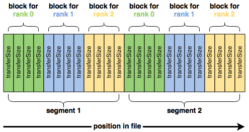
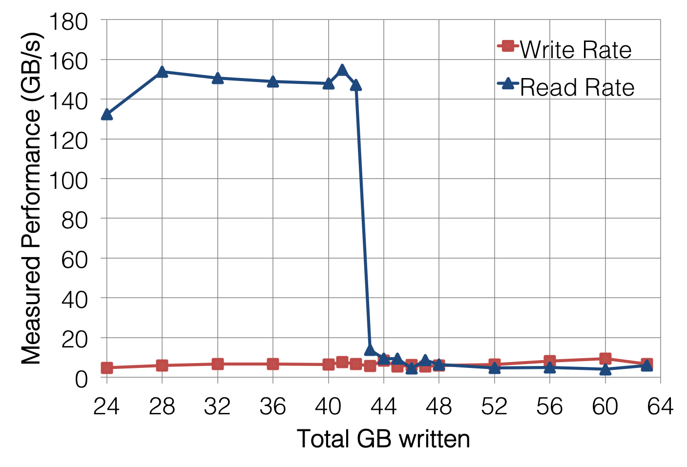
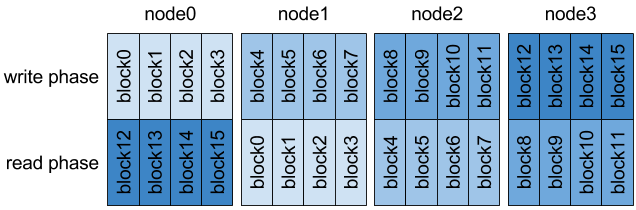
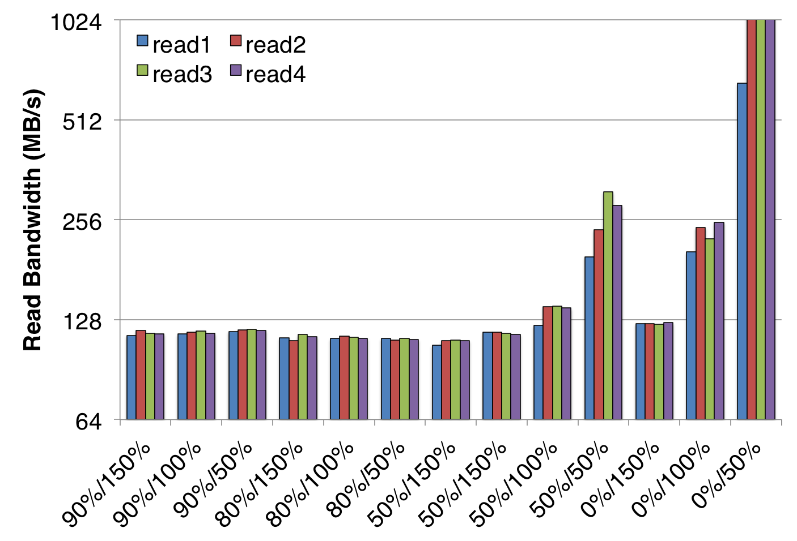
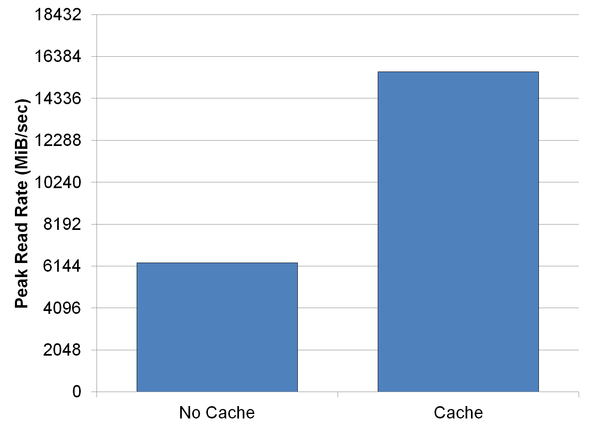

.. _first-steps:

First Steps with IOR
====================

This is a short tutorial for the basic usage of IOR and some tips on how to use
IOR to handel caching effects as these are very likely to affect your
measurements.

Running IOR
-----------
There are two ways of running IOR:

    1) Command line with arguments -- executable followed by command line
        options.

        ::
            $ ./IOR -w -r -o filename

        This performs a write and a read to the file 'filename'.

    2) Command line with scripts -- any arguments on the command line will
        establish the default for the test run, but a script may be used in
        conjunction with this for varying specific tests during an execution of
        the code. Only arguments before the script will be used!

        ::
            $ ./IOR -W -f script

        This defaults all tests in 'script' to use write data checking.

In this tutorial the first one is used as it is much easier to toy around with
an get to know IOR. The second option thought is much more useful to safe
benchmark setups to rerun later or to test many different cases.

Getting Started with IOR
------------------------

IOR writes data sequentially with the following parameters:

   * blockSize (-b)
   * transferSize (-t)
   * segmentCount (-s)
   * numTasks (-n)

which are best illustrated with a diagram:

These four parameters are all you need to get started with IOR.  However,
naively running IOR usually gives disappointing results.  For example, if we run
a four-node IOR test that writes a total of 16 GiB::

    $ mpirun -n 64 ./ior -t 1m -b 16m -s 16
    ...
    access bw(MiB/s) block(KiB) xfer(KiB) open(s)  wr/rd(s) close(s) total(s) iter
    ------ --------- ---------- --------- -------- -------- -------- -------- ----
    write  427.36    16384      1024.00   0.107961 38.34    32.48    38.34    2
    read   239.08    16384      1024.00   0.005789 68.53    65.53    68.53    2
    remove -         -          -         -        -        -        0.534400 2

we can only get a couple hundred megabytes per second out of a Lustre file
system that should be capable of a lot more.

Switching from writing to a single-shared file to one file per process using the
-F (filePerProcess=1) option changes the performance dramatically::

    $ mpirun -n 64 ./ior -t 1m -b 16m -s 16 -F
    ...
    access bw(MiB/s) block(KiB) xfer(KiB) open(s)  wr/rd(s) close(s) total(s) iter
    ------ --------- ---------- --------- -------- -------- -------- -------- ----
    write  33645     16384      1024.00   0.007693 0.486249 0.195494 0.486972 1
    read   149473    16384      1024.00   0.004936 0.108627 0.016479 0.109612 1
    remove -         -          -         -        -        -        6.08     1

This is in large part because letting each MPI process work on its own file cuts
out any contention that would arise because of file locking.

However, the performance difference between our naive test and the
file-per-process test is a bit extreme.  In fact, the only way that 146 GB/sec
read rate could be achievable on Lustre is if each of the four compute nodes had
over 45 GB/sec of network bandwidth to Lustre--that is, a 400 Gbit link on every
compute and storage node.

Effect of Page Cache on Benchmarking
------------------------------------
What's really happening is that the data being read by IOR isn't actually coming
from Lustre; rather, files' contents are already cached, and IOR is able to
read them directly out of each compute node's DRAM.  The data wound up getting
cached during the write phase of IOR as a result of Linux (and Lustre) using a
write-back cache to buffer I/O, so that instead of IOR writing and reading data
directly to Lustre, it's actually mostly talking to the memory on each compute
node.

To be more specific, although each IOR process thinks it is writing to a file on
Lustre and then reading back the contents of that file from Lustre, it is
actually

    1)  writing data to a copy of the file that is cached in memory.  If there
        is no copy of the file cached in memory before this write, the parts
        being modified are loaded into memory first.
    2)  those parts of the file in memory (called "pages") that are now
        different from what's on Lustre are marked as being "dirty"
    3)  the write() call completes and IOR continues on, even though the written
        data still hasn't been committed to Lustre
    4)  independent of IOR, the OS kernel continually scans the file cache for
        files who have been updated in memory but not on Lustre ("dirt pages"),
        and then commits the cached modifications to Lustre
    5)  dirty pages are declared non-dirty since they are now in sync with
        what's on disk, but they remain in memory

Then when the read phase of IOR follows the write phase, IOR is able to just
retrieve the file's contents from memory instead of having to communicate with
Lustre over the network.

There are a couple of ways to measure the read performance of the underlying
Lustre file system. The most crude way is to simply write more data than will
fit into the total page cache so that by the time the write phase has completed,
the beginning of the file has already been evicted from cache. For example,
increasing the number of segments (-s) to write more data reveals the point at
which the nodes' page cache on my test system runs over very clearly:

However, this can make running IOR on systems with a lot of on-node memory take
forever.

A better option would be to get the MPI processes on each node to only read data
that they didn't write.  For example, on a four-process-per-node test, shifting
the mapping of MPI processes to blocks by four makes each node N read the data
written by node N-1.

Since page cache is not shared between compute nodes, shifting tasks this way
ensures that each MPI process is reading data it did not write.

IOR provides the -C option (reorderTasks) to do this, and it forces each MPI
process to read the data written by its neighboring node. Running IOR with
this option gives much more credible read performance::

    $ mpirun -n 64 ./ior -t 1m -b 16m -s 16 -F -C
    ...
    access bw(MiB/s) block(KiB) xfer(KiB) open(s)  wr/rd(s) close(s) total(s) iter
    ------ --------- ---------- --------- -------- -------- -------- -------- ----
    write  41326     16384      1024.00   0.005756 0.395859 0.095360 0.396453 0
    read   3310.00   16384      1024.00   0.011786 4.95     4.20     4.95     1
    remove -         -          -         -        -        -        0.237291 1

But now it should seem obvious that the write performance is also ridiculously
high. And again, this is due to the page cache, which signals to IOR that writes
are complete when they have been committed to memory rather than the underlying
Lustre file system.

To work around the effects of the page cache on write performance, we can issue
an fsync() call immediately after all of the write()s return to force the dirty
pages we just wrote to flush out to Lustre. Including the time it takes for
fsync() to finish gives us a measure of how long it takes for our data to write
to the page cache and for the page cache to write back to Lustre.

IOR provides another convenient option, -e (fsync), to do just this. And, once
again, using this option changes our performance measurement quite a bit::

    $ mpirun -n 64 ./ior -t 1m -b 16m -s 16 -F -C -e
    ...
    access bw(MiB/s) block(KiB) xfer(KiB) open(s)  wr/rd(s) close(s) total(s) iter
    ------ --------- ---------- --------- -------- -------- -------- -------- ----
    write  2937.89   16384      1024.00   0.011841 5.56     4.93     5.58     0
    read   2712.55   16384      1024.00   0.005214 6.04     5.08     6.04     3
    remove -         -          -         -        -        -        0.037706 0

and we finally have a believable bandwidth measurement for our file system.

Defeating Page Cache
Since IOR is specifically designed to benchmark I/O, it provides these options
that make it as easy as possible to ensure that you are actually measuring the
performance of your file system and not your compute nodes' memory.  That being
said, the I/O patterns it generates are designed to demonstrate peak performance,
not reflect what a real application might be trying to do, and as a result,
there are plenty of cases where measuring I/O performance with IOR is not always
the best choice.  There are several ways in which we can get clever and defeat
page cache in a more general sense to get meaningful performance numbers.

When measuring write performance, bypassing page cache is actually quite simple;
opening a file with the O_DIRECT flag going directly to disk.  In addition,
the fsync() call can be inserted into applications, as is done with IOR's -e
option.

Measuring read performance is a lot trickier.  If you are fortunate enough to
have root access on a test system, you can force the Linux kernel to empty out
its page cache by doing

::
    # echo 1 > /proc/sys/vm/drop_caches

and in fact, this is often good practice before running any benchmark
(e.g., Linpack) because it ensures that you aren't losing performance to the
kernel trying to evict pages as your benchmark application starts allocating
memory for its own use.

Unfortunately, many of us do not have root on our systems, so we have to get
even more clever.  As it turns out, there is a way to pass a hint to the kernel
that a file is no longer needed in page cache::

    #define _XOPEN_SOURCE 600
    #include <unistd.h>
    #include <fcntl.h>
    int main(int argc, char *argv[]) {
        int fd;
        fd = open(argv[1], O_RDONLY);
        fdatasync(fd);
        posix_fadvise(fd, 0,0,POSIX_FADV_DONTNEED);
        close(fd);
        return 0;
    }

The effect of passing POSIX_FADV_DONTNEED using posix_fadvise() is usually that
all pages belonging to that file are evicted from page cache in Linux.  However,
this is just a hint--not a guarantee--and the kernel evicts these pages
asynchronously, so it may take a second or two for pages to actually leave page
cache.  Fortunately, Linux also provides a way to probe pages in a file to see
if they are resident in memory.

Finally, it's often easiest to just limit the amount of memory available for
page cache.  Because application memory always takes precedence over cache
memory, simply allocating most of the memory on a node will force most of the
cached pages to be evicted.  Newer versions of IOR provide the memoryPerNode
option that do just that, and the effects are what one would expect:

The above diagram shows the measured bandwidth from a single node with 128 GiB
of total DRAM.  The first percent on each x-label is the amount of this 128 GiB
that was reserved by the benchmark as application memory, and the second percent
is the total write volume.  For example, the "50%/150%" data points correspond
to 50% of the node memory (64 GiB) being allocated for the application, and a
total of 192 GiB of data being read.

This benchmark was run on a single spinning disk which is not capable of more
than 130 MB/sec, so the conditions that showed performance higher than this were
benefiting from some pages being served from cache.  And this makes perfect
sense given that the anomalously high performance measurements were obtained
when there was plenty of memory to cache relative to the amount of data being
read.

Corollary
---------
Measuring I/O performance is a bit trickier than CPU performance in large part
due to the effects of page caching.  That being said, page cache exists for a
reason, and there are many cases where an application's I/O performance really
is best represented by a benchmark that heavily utilizes cache.

For example, the BLAST bioinformatics application re-reads all of its input data
twice; the first time initializes data structures, and the second time fills
them up.  Because the first read caches each page and allows the second read to
come out of cache rather than the file system, running this I/O pattern with
page cache disabled causes it to be about 2x slower:

Thus, letting the page cache do its thing is often the most realistic way to
benchmark with realistic application I/O patterns.  Once you know how page cache
might be affecting your measurements, you stand a good chance of being able to
reason about what the most meaningful performance metrics are.
